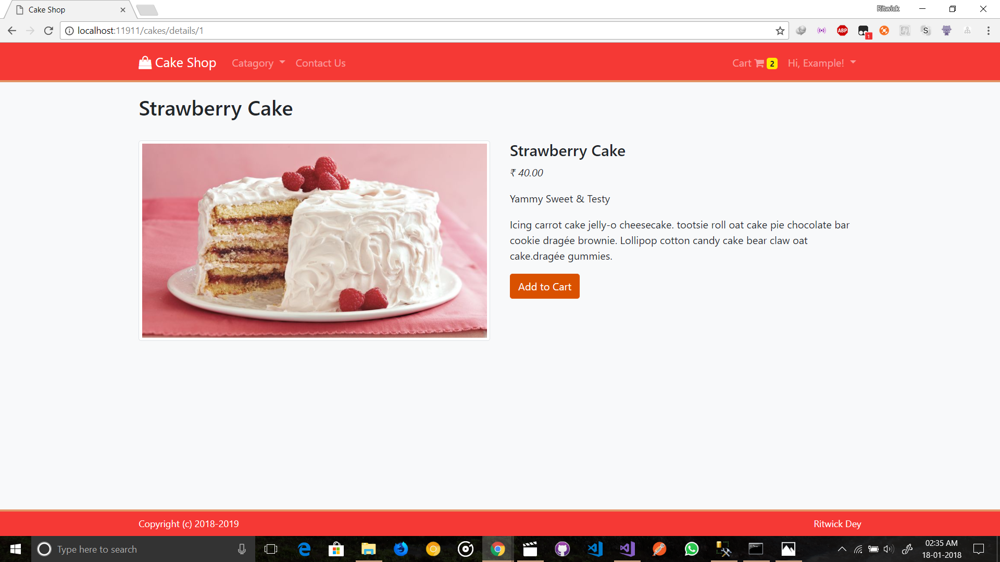
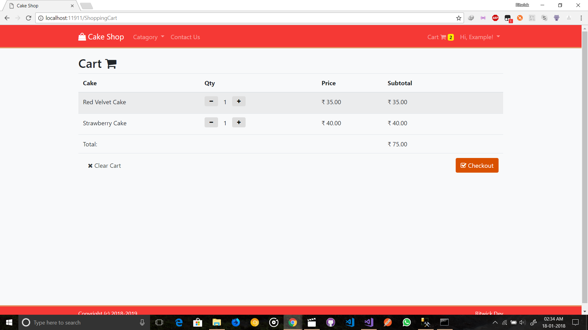
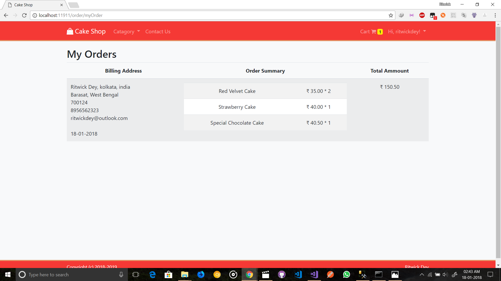
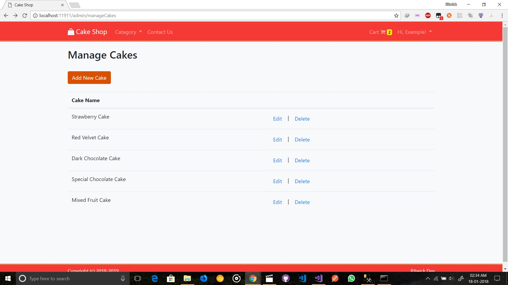

# Cake Shop

A sample Cake Shop Website built with ASP.NET Core (Multi-Page Application)


## APP/Code Features 
- Only Admin can perform Create/Edit/Delete cakes & manage Orders.
- Normal User can only can buy cakes & view their orders.
- Managing Cart System using cookie.
- Client Side & Server side validation,
- Cookie Based Authentication & Authorization - Not Session
- Login through either `Username` or `Email`.
- Responsive UI
- Repository Pattern 
- Application Architecture is decoupled form ORM (Entity Framework)

## Framework / Library 
- ASP.NET Core 2.0 *(Backend)*
- Razor View Engine *(For generating markup)*
- Entity Framework Core *(ORM)*
- ASP.NET Identity *(Cookie Based Authentication & Authorization - Not Session)*
- AutoMapper *(For mapping into Domain Model & DTO)*
- jQuery & Bootstap 4

## To run the project locally:
   > admin account : `admin@admin.com` and Password: `Passw@rd!123` (You can change it from `appsettings.json` before apply `update database`)

   > Make sure, dotnet core SDK & npm is installed in your machine.

- **Using VS2019**
     ``` 
       > cd \
       > git clone https://github.com/joelwetzel/Cake-Shop.git
       > cd Cake-Shop/
       > cd CakeShop
       > npm install
       > npm update
    ```
    - Now Open the `CakeShop.sln` through `Visual Studio 2019`.
    - Open `appsettings.json` & make note of the connection string and the admin credentials.
    - Hit `Ctrl+Shift+B` to build.
    - Open `Package Manager Console` from `Tools` and enter `update-database`.  This will create the database within SQL Express.
    - Hit `Ctrl+F5` (in Visual Studio) to run without debugging, or F5 to run with debugging.
    - After you run it successfully for the first time, if you inspect the database using SQL Management Studio, you'll see that the admin user was added to the AspNetUsers table, and it was granted a role in the AspNetUserRoles table.


## Screenshots





